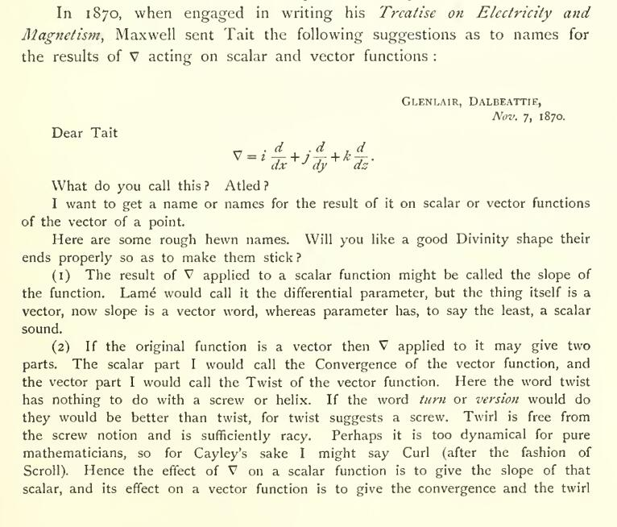
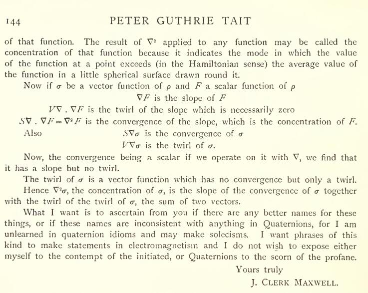
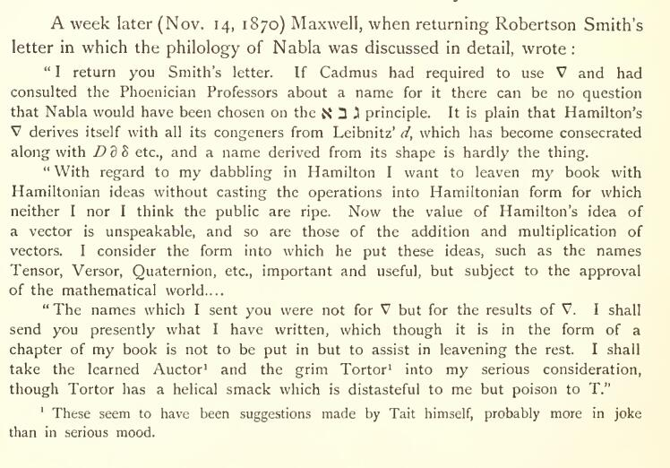

Ex "The Life And Times Of Peter Guthrie Tait"
https://webhomes.maths.ed.ac.uk/~v1ranick/papers/taitbio.pdf
paginae CXLIII-IV

---

In 1870, when engaged in writing his *Treatise on Electricity and Magnetism*, Maxwell sent Tait the following suggestions as to
names for the results of ∇ acting on scalar and vector functions:

GLENLAIR, DALBEATTIE
*Nov. 7, 1870.*

Dear Tait

∇ = i d/dx + j d/dy + k d/dz.

What do you call this? Atled?

I want to get a name or names for the result of it on scalar or vector functions of the vector of a point.

Here are some rough hewn names. Will you like a good Divinity shape their ends properly so as to make them stick?

1. The result of ∇ applied to a scalar function might be called the slope of the function. Lamé would call it the differential
parameter, but the thing itself is a vector, now slope is a vector word, whereas parameter has, to say the least, a scalar
sound.

2. If the original function is a vector then ∇ applied to it may give two parts. The scalar part I would call the Convergence of
the vector function, and the vector part I would call the Twist of the vector function. Here the word twist has nothing to do
with a screw or helix. If the word turn or version would do they would be better than twist, for twist suggests a screw. Twirl
is free from the screw notion and is sufficiently racy. Perhaps it is too dynamical for pure mathematicians, and for Cayley’s
sake I might say Curl (after the fashion of Scroll). Hence the effect of ∇ on a scalar function is to give the slope of that
scalar, and its effect on a vector function is to give the convergence and the twirl

---

of that function. The result of ∇² applied to any function may be called the concentration of that function because it indicates
the mode in which the value of the function at a point exceeds (in the Hamiltonian sense) the average value of the function in a
little spherical surface drawn round it.

Now if σ be a vector function of ρ and F a scalar function of ρ

∇F is the slope of F

V∇·∇F is the twirl of the slope which is necessarily zero S∇·∇F = ∇²F is the convergence of the slope, which is the
concentration of F.

Also S∇σ is the convergence of σ V∇σ is the twirl of σ.

Now, the convergence being a scalar if we operate on it with ∇, we find that it has a slope but no twirl.

The twirl of σ is a vector function which has no convergence but only a twirl.  Hence ∇²σ, the concentration of σ, is the slope
of the convergence of σ together with the twirl of the twirl of σ, the sum of two vectors.

What I want is to ascertain from you if there are any better names for these things, or if these names are inconsistent with
anything in Quaternions, for I am unlearned in quaternion idioms and may make solecisms. I want phrases of this kind to make
statements in electromagnetism and I do not wish to expose either myself to the contempt of the initiated, or Quaternions to the
scorn of the profane.

Yours truly, J. CLERK MAXWELL.

---

A week later (Nov. 14, 1870) Maxwell, when returning Robertson Smith's letter in which the philology of Nabla was discussed in
detail, wrote:

“I return you Smith’s letter. If Cadmus had required to use ∇ and had consulted the Phoenician Professors about a name for it
there can be no question that Nabla would have been chosen on the ‹נבל› principle. It is plain that Hamilton’s ∇ derives itself
with all its congeners from Leibnitz’ *d*, which has become consecrated along with *Dδ* etc., and a name derived from its shape
is hardly the thing.

“With regard to my dabbling in Hamilton I want to leaven my book with Hamiltonian ideas without casting the operations into
Hamiltonian form for which neither I nor I think the public are ripe. Now the value of Hamilton’s idea of a vector is
unspeakable, and so are those of the addition and multiplication of vectors. I consider the form into which he put these ideas,
such as the names Tensor, Versor, Quaternion, etc., important and useful, but subject to the approval of the mathematical
world....

“The names which I sent you were not for ∇ but for the results of ∇. I shall send you presently what I have written, which
though it is in the form of a chapter of my book is not to be put in but to assist in leaving the rest. I shall take the learned
Auctor¹ and the grim Tortor¹ into my serious consideration, though Tortor has a helical smack which is distasteful to me but
poison to T.”

¹ These seem to have been suggestions made by Tait himself, probably more in joke than in serious mood.
